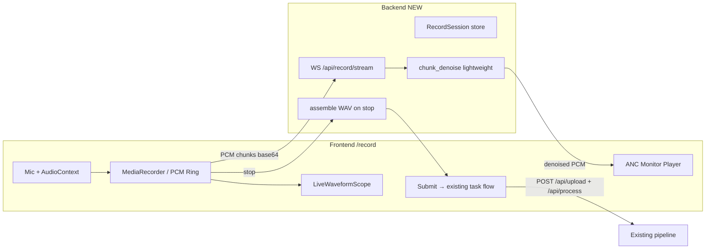

# AI 提示词：Denoise Studio Signal Console — 实时录音与实时降噪页（Live Capture）

> 复制整段给 Cursor / Claude。在 **已上线的业务六页 + Showcase + RackPanel + 互动背景 + MOD-HS01** 基础上，新增 **实时录音工作台**，支持麦克风采集、波形/VU 监视、**录音过程中或分段回放时的低延迟降噪监听**，并在停止录音后无缝接入现有 **upload → process → overview** 全链路。  
> 前置版本：`web-signal-console-rack-polish`、`web-signal-console-headphone-rack`、`signal-console-motion-and-pages`。

---

## 角色与目标

你是资深全栈音频工程师 + 广播 HMI 前端，负责为 Denoise Studio 增加 **「实时录音 + 实时降噪」** 能力，使其从「仅支持文件上传」扩展为「现场采集 → 即时 ANC 试听 → 一键进入正式降噪任务」。

**用户故事：**

1. 用户打开 **Live Capture** 页，授权麦克风，看到输入电平与波形。
2. 点击 **REC**，开始录音；可切换 **ANC MONITOR** 听到经降噪处理的实时监听（允许 300–800ms 缓冲延迟，需 UI 明示）。
3. 停止录音后，可 **A/B 对比** 原始与实时降噪版，满意则 **提交任务** 走现有 `auto / deepfilter / distill` 全管线。
4. 全程视觉语言与 Upload / Monitor 一致：**机架模块、LED、VU、mono 读数**，不是通用录音 App。

**「实时降噪」在本项目中的定义（必须写进实现，避免过度承诺）：**

| 层级 | 能力 | 延迟目标 | 算法 |
|------|------|----------|------|
| **L1 监听** | 录音中耳机/扬声器播放降噪轨 | 300–800ms | 后端分块 `base_omlsa_mcra` 或 `noisereduce`（轻量） |
| **L2 回放** | 停止后即时试听整段降噪预览 | 按录音时长，流式拼接 | 同上，会话内缓存 |
| **L3 正式** | 创建 task，走现有 `/api/process` | 异步，与 Upload 一致 | `auto` 路由 + 可选 `run_distill_refine` |

❌ **禁止** 声称「零延迟 / 全频段 DeepFilterNet 实时」——DFN3 与蒸馏精炼为批处理，仅用于 L3。  
✅ **必须** 在 UI 标注 `LIVE PREVIEW` vs `FULL PIPELINE` 差异。

---

## 技术约束（必须遵守）

| 项 | 要求 |
|----|------|
| 前端路径 | `analysis/denoise_selection/webapp/frontend/` |
| 后端路径 | `analysis/denoise_selection/webapp/backend/`（**本次允许** 新增 streaming 路由，**禁止** 破坏现有 `/api/upload`、`/api/process` 契约） |
| 栈 | React 18 + TS + Vite；Web Audio API + `MediaRecorder`；后端 FastAPI + WebSocket 或分块 REST |
| 禁止 | Tailwind、MUI、紫色渐变、Inter/Roboto、Three.js、在浏览器内嵌完整 PyTorch |
| 字体 | Antonio + Newsreader + Fragment Mono |
| 采样率 | 统一 **16 kHz mono float32**（与 `load_audio_mono` 一致）；前端 `AudioContext` 重采样 |
| 性能 | 分块 256–512ms；Canvas rAF；`visibilitychange` 暂停；移动端可降级为「录完再降噪预览」 |
| 测试 | 前端 `npm run build && npm test`；后端 `pytest` 新增 `test_record_stream.py` |
| i18n | 文案键写入 `src/i18n/index.ts` 中英文 |
| 无障碍 | 录音状态 `aria-live="polite"`；REC 按钮有明确 label；`prefers-reduced-motion` 关闭波形动画 |

---

## 现有资产（必须复用）

| 资产 | 路径 | 用途 |
|------|------|------|
| 机架壳 | `RackPanel.tsx` | 页顶 `MOD-07 / LIVE` |
| 方法选择 | `MethodSelector.tsx`、`methodOptions.ts` | L3 正式处理 method |
| 试听 | `AudioComparePlayer.tsx` | 停止后 raw vs preview A/B |
| VU | `VuMeterBar.tsx` | 输入/输出电平 |
| 监听单元 | `HeadphoneRackUnit.tsx` | ANC monitor 状态 LED |
| 背景动效 | `useBackgroundMotion.ts`、`ScopeCanvas.tsx` | recording → processing 背景联动 |
| 上传流程 | `api.ts` `uploadAudio` / `startProcess` | L3 提交 |
| 降噪核心 | `denoise_runner.py` `_run_noisereduce`、`base_omlsa_mcra` | L1/L2 分块处理 |
| 任务存储 | `file_store.py`、`task_store.py` | 会话 WAV 落盘 |

**当前业务路由（保持 path 不变，可增）：**

```
/  /upload  /progress  /overview  /charts  /history  /showcase/*
```

**本次新增：**

```
/record  →  LiveCapturePage   实时录音与降噪工作台
```

导航：`GlassNav.tsx` 在 Upload 与 Progress 之间插入 `navRecord`（「录音」/ Live Capture）。Home 机架区增加次要 CTA 链到 `/record`。

---

## 架构总览



### 推荐实现策略（分阶段，禁止跳步）

| 阶段 | 交付 | 说明 |
|------|------|------|
| **P0** | 录音页骨架 + 麦克风 + 波形 + 停止后导出 WAV | 无后端改动；停止后手动「提交任务」走现有 upload |
| **P1** | 后端 `RecordSession` + 分块降噪 + ANC 监听 | 真·实时降噪核心 |
| **P2** | 停止后 A/B、自动创建 task、跳转 progress | 与 Upload 页参数对齐 |
| **P3** | 噪声剖面校准（REC 前 2s silence profile）、电平告警 | 体验抛光 |

**P0 完成后即可演示；P1 为「实时降噪」验收硬门槛。**

---

## 后端规格（P1 起）

### 新路由 `app/routers/record.py`

```python
# 会话生命周期
POST   /api/record/session          → { session_id, sample_rate: 16000 }
DELETE /api/record/session/{id}     → 清理临时文件

# 分块处理（REST 备选，优先 WebSocket）
POST   /api/record/{id}/chunk       → body: { seq, pcm_b64, finalize: false }
                                    → { seq, denoised_b64, latency_ms }

# 结束录音
POST   /api/record/{id}/finish      → { raw_wav_path, preview_wav_path, duration_sec }

# WebSocket（推荐）
WS     /api/record/{id}/stream      → 客户端发 { type:"chunk", seq, pcm }
                                    ← 服务端回 { type:"denoised", seq, pcm }
```

### 服务 `app/services/record_session.py`

- 内存或 `data/record_sessions/{id}/` 存 `raw_chunks/`、`denoised_chunks/`
- `chunk_denoise(pcm: np.ndarray, sr: int, method: str = "omlsa_preview")`：
  - 默认 `base_omlsa_mcra`（与项目算法栈一致）
  - 可选 `noisereduce` + `strength` 查询参数
- **重叠拼接**：块长 512ms，hop 384ms，crossfade 64ms，避免块边界咔嗒声
- `finish()` 用 `soundfile` 写 `raw.wav`、`preview_denoised.wav`
- 会话 TTL 30min，定时清理

### 与正式任务衔接（P2）

```python
POST /api/record/{id}/commit
body: { method, run_distill_refine, noisereduce_strength }
→ 将 raw.wav 复制到 FILE_STORE 新 task_id
→ TASK_STORE.create + 可选立即 startProcess（复用 process.py 逻辑）
→ { task_id, status }
```

**禁止** 在 WebSocket 热路径调用 `run_deepfilter` 或 `refine_with_student`。

### 错误码

| code | 场景 |
|------|------|
| `mic_unavailable` | 前端无麦克风（仅文档） |
| `session_not_found` | 过期 session |
| `chunk_out_of_order` | seq 乱序 |
| `record_too_long` | 超过 10min 上限 |

---

## 前端规格

### 页面 `pages/LiveCapturePage.tsx`

```tsx
type Props = { setTaskId: (id: string) => void };

type CapturePhase = "idle" | "arming" | "recording" | "preview" | "committing";
```

**布局（Signal Console 机架）：**

```
┌─ RackPanel MOD-07 / LIVE ─────────────────────────────────────┐
│ [flow strip] 01 Mic · 02 REC · 03 ANC · 04 Commit               │
├─────────────────────────────────────────────────────────────────┤
│ ┌─ MOD-07A INPUT METER ─┐  ┌─ MOD-07B ANC MONITOR ──────────┐ │
│ │ LiveWaveformScope      │  │ HeadphoneRackUnit + latency ms │ │
│ │ VuMeterBar in/out      │  │ toggle ANC MONITOR             │ │
│ └────────────────────────┘  └────────────────────────────────┘ │
│ ┌─ TRANSPORT ────────────────────────────────────────────────┐ │
│ │ [● REC] [■ STOP] [▶ Preview]  timer 00:00  level -12 dBFS  │ │
│ └────────────────────────────────────────────────────────────┘ │
│ （phase=preview）AudioComparePlayer raw vs preview             │
│ （phase=preview）MethodSelector + distill + [Commit Task]      │
└────────────────────────────────────────────────────────────────┘
```

### 核心 Hook — `hooks/useLiveCapture.ts`

职责：

1. `requestMic()` → `navigator.mediaDevices.getUserMedia({ audio: { echoCancellation: false, noiseSuppression: false, autoGainControl: false } })`  
   - **必须关闭** 浏览器内置降噪，否则与项目算法对比失真
2. `AudioContext` @ 16kHz（`createMediaStreamSource` + `ScriptProcessorNode` 或 `AudioWorklet`）
3. 环形缓冲送 `LiveWaveformScope`（AnalyserNode RMS）
4. `startRecording()` → 创建 backend session + 打开 WebSocket
5. 每 `chunkMs`（默认 512）发送 PCM Int16/base64
6. 收到 denoised chunk → `AudioBufferQueue` 顺序播放（ANC monitor）
7. `stopRecording()` → finish session，进入 `preview` phase
8. `commitTask()` → `POST commit` 或 `uploadAudio(Blob)` + `startProcess`

**状态机：**

| phase | REC 钮 | ANC toggle | LED |
|-------|--------|------------|-----|
| `idle` | 可点 | 禁用 | idle |
| `arming` | 倒计时 3s | 禁用 | processing |
| `recording` | 停止 | 可开 | active（REC 脉动） |
| `preview` | 重录 | 关 | active |
| `committing` | 禁用 | 禁用 | processing |

### 组件 — `components/live/LiveWaveformScope.tsx`

- 基于 `MiniScope.tsx` 改造，接 **真实** `AnalyserNode` 时域数据，非假 sine
- 双轨叠加：上层 `--signal` 原始，下层 `--amber` 降噪预览电平（可选）
- `recording` 时右侧时间轴滚动；`prefers-reduced-motion` 静态柱状

### 组件 — `components/live/RecordTransport.tsx`

- 大圆形 REC（`--danger`），STOP（`--text-secondary`）
- `aria-pressed`、`aria-live` 播报「录音中」「已停止」
- 最长 10:00，超限自动 stop + toast

### 样式 — `styles/live-capture.css`

- 复用 `tokens.css`、`rack-polish.css`
- 新增 `--rec-pulse`、`--anc-latency-badge`
- REC 动画：与 `rack-led-active` 同频，勿霓虹

### 路由与 API 扩展

`app/router.tsx`：

```tsx
<Route path="/record" element={<LiveCapturePage setTaskId={setTaskId} />} />
```

`lib/api.ts` 新增（不改动现有函数签名）：

```ts
export async function createRecordSession(): Promise<{ session_id: string; sample_rate: number }>;
export function recordStreamUrl(sessionId: string): string; // ws://
export async function finishRecordSession(sessionId: string): Promise<{ duration_sec: number }>;
export async function commitRecordSession(sessionId: string, req: ProcessRequest): Promise<{ task_id: string }>;
```

---

## 关键实现细节（易错点）

1. **HTTPS / localhost**：`getUserMedia` 需安全上下文；开发时 Vite HTTPS 或 localhost。
2. **浏览器降噪关闭**：见 `getUserMedia` constraints；UI 提示用户关闭系统级「麦克风增强」。
3. **WebSocket 背压**：发送队列超 8 块时丢最旧块并显示 `ancDegraded` 徽章，防延迟累积。
4. **耳机反馈**：默认 ANC monitor 走耳机输出；检测 `sinkId` 不可用时仅波形不回放。
5. **停止后 Blob**：`MediaRecorder` 产出 webm 仅作备份；正式 WAV 以后端 `finish` 为准。
6. **与 Upload 去重**：Commit 后 `setTaskId` + `navigate('/progress')`，行为与 `UploadConfigPage.submit` 一致。
7. **空会话**：无 task 时 Live 页仍可用；Commit 后才关联 task pill。

---

## 建议实施顺序

1. `LiveCapturePage` 静态布局 + `live-capture.css` + i18n + 路由/导航
2. `useLiveCapture` P0：仅麦克风 + 波形 + MediaRecorder + 下载 WAV
3. 后端 `record_session.py` + WebSocket + `chunk_denoise`
4. 前端 ANC monitor 播放队列 + latency 显示
5. `commit` 接现有 process；`AudioComparePlayer` 预览
6. `HeadphoneRackUnit` 联动 + `useBackgroundMotion` recording 态
7. pytest + 前端 smoke test + `npm run build`

---

## 验收标准

- [ ] `/record` 可授权麦克风，REC/STOP 可用，波形随真实输入变化
- [ ] ANC MONITOR 开启后，能听到延迟 ≤1s 的降噪监听（P1）
- [ ] UI 区分 **LIVE PREVIEW** 与 **FULL PIPELINE** 文案
- [ ] 停止后可 A/B 原始 vs preview；Commit 后进入 `/progress` 且 task 可查
- [ ] 正式处理可选 `auto`、`deepfilter`、`run_distill_refine`，与 Upload 页一致
- [ ] 浏览器内置 `noiseSuppression: false` 已 enforced
- [ ] 机架视觉在深浅主题下可读；无紫色渐变/Inter
- [ ] `prefers-reduced-motion` 无 REC 脉动/波形滚动
- [ ] `npm run build`、`npm test`、`pytest` 通过
- [ ] 移动端：可录音 + 停止 + 提交；ANC 可降级为仅 preview 相位

---

## i18n 键清单（示例）

| 键 | zh | en |
|----|----|----|
| `navRecord` | 录音 | Live |
| `recordTitle` | 实时采集 | Live capture |
| `recordSubtitle` | 麦克风输入 · 实时 ANC 监听 · 一键提交 | Mic in · live ANC monitor · one-click commit |
| `recordFlowMic` | 麦克风 | Mic |
| `recordFlowRec` | 录制 | Record |
| `recordFlowAnc` | 监听 | Monitor |
| `recordFlowCommit` | 提交 | Commit |
| `recordStart` | 开始录音 | Start recording |
| `recordStop` | 停止 | Stop |
| `recordAncOn` | ANC 监听开 | ANC monitor on |
| `recordAncOff` | ANC 监听关 | ANC monitor off |
| `recordLatency` | 监听延迟约 {ms} ms | Monitor latency ~{ms} ms |
| `recordPreviewTag` | 实时预览（轻量算法） | Live preview (lightweight) |
| `recordPipelineTag` | 正式管线（完整降噪） | Full pipeline |
| `recordCommit` | 提交降噪任务 | Commit denoise task |
| `recordReTake` | 重新录制 | Re-record |
| `recordMicDenied` | 需要麦克风权限 | Microphone permission required |
| `recordTooLong` | 已达最长录音时长 | Maximum recording length reached |
| `recordAncDegraded` | 监听缓冲过载，延迟增加 | Monitor buffer overloaded |

---

## 测试要点

**后端 `tests/test_record_stream.py`：**

- 创建 session → 发送 3 个静音+噪声 chunk → denoised 长度一致
- `finish` 产出有效 WAV，sample_rate=16000
- `commit` 创建 task 且 `status` 为 `queued` 或 `processing`

**前端（可选 `live-capture.test.ts`）：**

- `useLiveCapture` 状态机在 mock API 下 idle → recording → preview 转换
- `RecordTransport` REC 按钮 `aria-pressed` 正确

---

## 一句话版（快速粘贴）

> 新增 `/record` LiveCapturePage（MOD-07）：Web Audio 录音 + LiveWaveformScope + 后端 WebSocket 分块 `base_omlsa_mcra` 实时 ANC 监听（300–800ms），停止后 A/B preview 并 Commit 走现有 upload/process；复用 RackPanel/VU/HeadphoneRackUnit/AudioComparePlayer；关闭浏览器降噪；纯 CSS 机架风；pytest + build/test 通过。

---

## 相关文档

- 机架语言：`docs/prompts/signal-console-ui-polish.md`
- 监听单元：`docs/prompts/signal-console-headphone-module.md`
- 动效系统：`docs/prompts/signal-console-motion-and-pages.md`
- 上传流程参考：`frontend/src/pages/UploadConfigPage.tsx`
- 建议版本标签：`web-signal-console-live-capture`
