# Scene01（white_snr15）含噪语音全维度系统分析报告
（面向去噪算法设计：clean / noise / mix 三路对比）

## 0. 分析对象与目标

- 场景：`scene01_white_snr15.wav`
- 对比信号：
  - 纯语音：`clean_reference.wav`
  - 纯噪声：`scene01` 对应噪声分量（`mix-clean`）
  - 含噪语音：`scene01_white_snr15.wav`
- 目标：量化三者差异，给出对 ANASS 三模块（VAD门控噪声估计、自适应过减系数、音乐噪声抑制）的可执行设计建议。

---

## 1. 时域特性分析

### 1.1 基础统计量（三信号对比）

| 指标 | 纯语音 clean | 纯噪声 noise | 含噪语音 mix |
|---|---:|---:|---:|
| 均值 | 0.002408 | -0.000002 | 0.002406 |
| 方差 | 0.001254 | 0.000040 | 0.001294 |
| 峰值幅度 \|x\|max | 0.3263 | 0.0263 | 0.3344 |
| RMS | 0.03549 | 0.00631 | 0.03605 |
| 动态范围（dB） | 230.27 | 36.44 | 52.83 |

### 1.2 短时能量与短时过零率分布

#### 短时能量（RMS）统计

| 指标 | clean | noise | mix |
|---|---:|---:|---:|
| mean | 0.02432 | 0.00631 | 0.02657 |
| std | 0.02586 | 0.00023 | 0.02437 |
| p10 | 0.00000 | 0.00603 | 0.00630 |
| p50 | 0.01558 | 0.00630 | 0.01677 |
| p90 | 0.06397 | 0.00659 | 0.06412 |

#### 短时过零率（ZCR）统计

| 指标 | clean | noise | mix |
|---|---:|---:|---:|
| mean | 0.1916 | 0.4996 | 0.3272 |
| std | 0.2060 | 0.0265 | 0.1805 |
| p10 | 0.0000 | 0.4700 | 0.1150 |
| p50 | 0.1050 | 0.5000 | 0.2888 |
| p90 | 0.5795 | 0.5325 | 0.5595 |

#### 可分性（clean vs noise）

| 特征 | Cohen’s d（越大越可分） |
|---|---:|
| 短时能量 | 0.985 |
| 过零率 | 2.097 |
| 谱平坦度（辅助） | 1.750 |

### 1.3 浊音/清音/噪声自相关对比

| 帧类型 | 自相关最大次峰值 | 峰值时延（sample） | 解释 |
|---|---:|---:|---|
| 浊音帧 | 0.733 | 96 | 强周期性（基音结构明显） |
| 清音帧 | 0.203 | 36 | 周期性弱，呈噪声样摩擦特征 |
| 噪声帧 | 0.120 | 67 | 近随机，无稳定谐波周期 |

### 1.4 图表（时域）

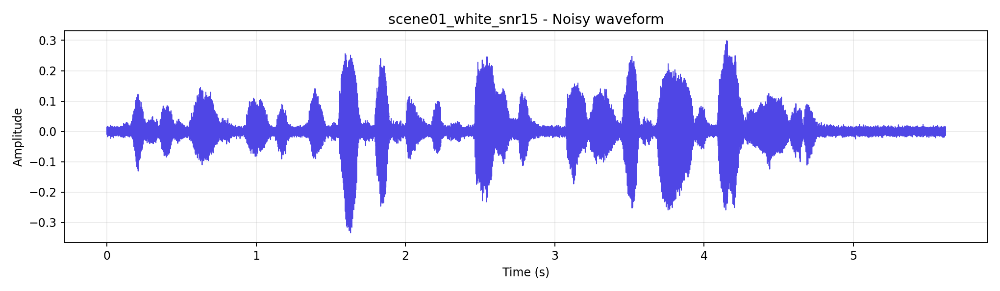  
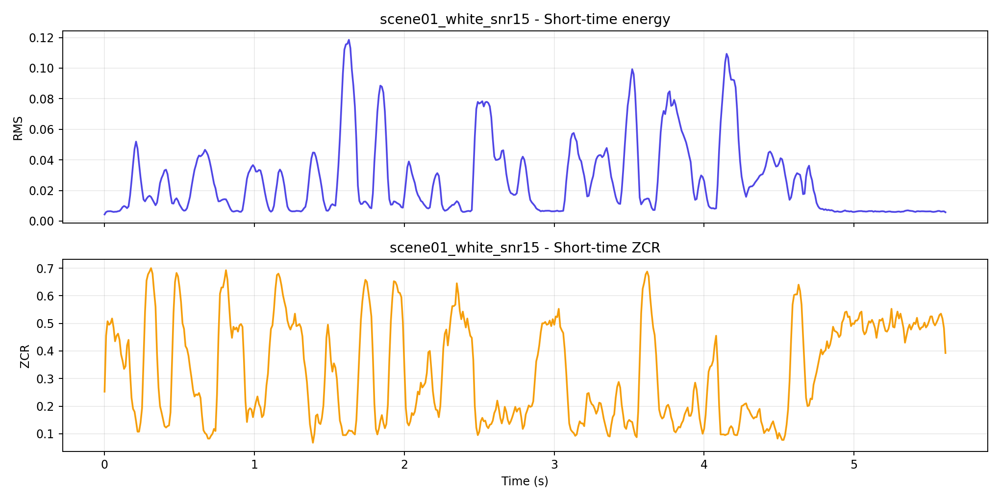  
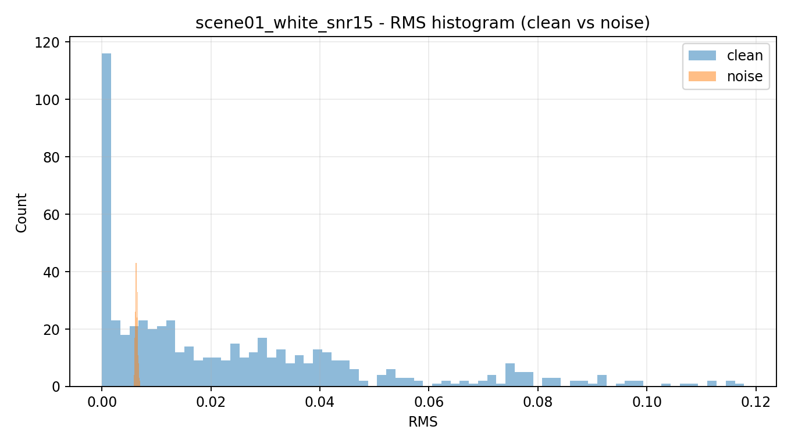  
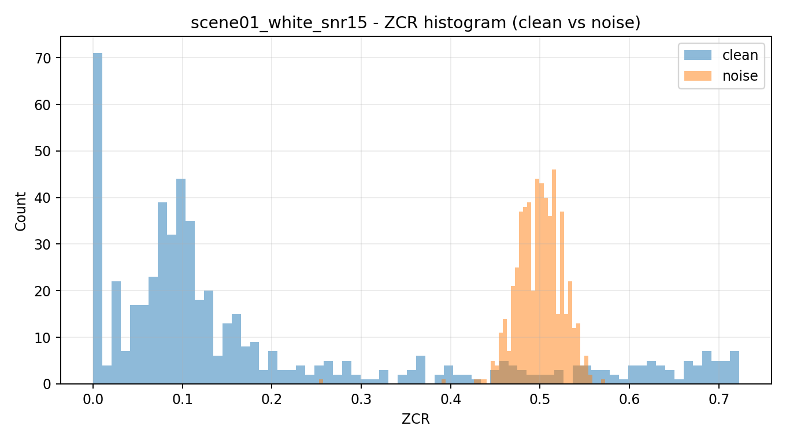

---

## 2. 频域特性分析

### 2.1 Welch 功率谱与分频段 SNR

| 频段 | 频率范围 | SNR(dB) |
|---|---|---:|
| 低频 | 0–300 Hz | 16.09 |
| 中频 | 300–3400 Hz | 18.83 |
| 高频 | 3400–8000 Hz | 1.46 |

### 2.2 谱平坦度与谱熵分布

#### 谱平坦度（Spectral Flatness）

| 指标 | clean | noise | mix |
|---|---:|---:|---:|
| mean | 0.162 | 0.561 | 0.240 |
| p50 | 0.006 | 0.562 | 0.154 |
| p90 | 1.000 | 0.590 | 0.563 |

#### 谱熵（Spectral Entropy, 归一化）

| 指标 | clean | noise | mix |
|---|---:|---:|---:|
| mean | 0.592 | 0.932 | 0.670 |
| p50 | 0.497 | 0.932 | 0.617 |
| p90 | 1.000 | 0.938 | 0.932 |

### 2.3 共振峰/谐波结构（clean 主峰）

clean PSD 主要峰值频率（Hz）：  
`[203.1, 375.0, 671.9, 890.6, 1109.4, 1328.1]`

### 2.4 图表（频域）

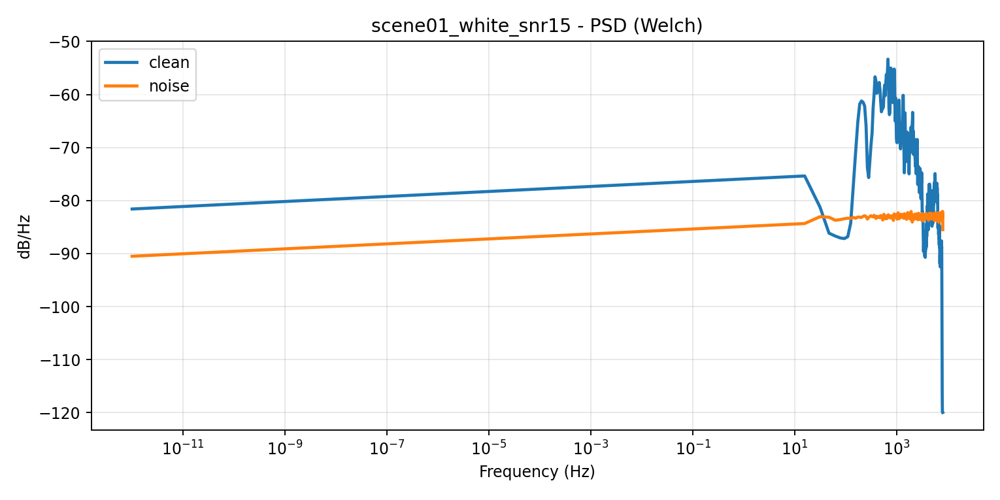  
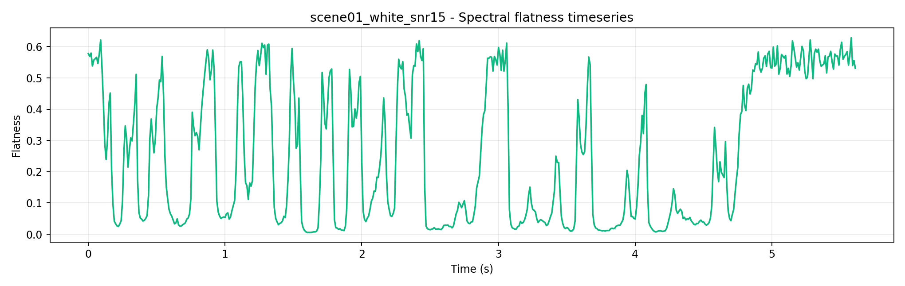  
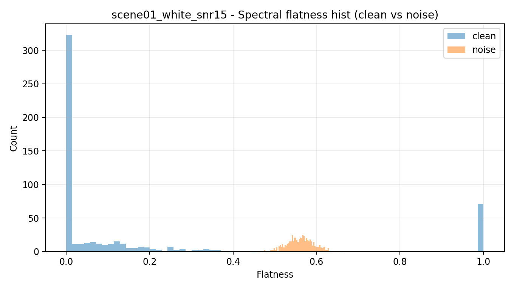

---

## 3. 时频域特性分析

### 3.1 噪声时变性与平稳性量化

| 指标 | 数值 |
|---|---:|
| 噪声非平稳性指数 | 0.806 |
| 时间相关衰减滞后（帧） | 4 |
| 频率相关衰减滞后（频点） | 3 |

### 3.2 局部 SNR 时空分布

| 指标 | 值 |
|---|---:|
| mean | -14.53 dB |
| median | -14.16 dB |
| p10 | -40.00 dB（裁剪下限） |
| p90 | 10.39 dB |
| 比例 `SNR<0dB` | 76.72% |
| 比例 `SNR<-5dB` | 67.83% |
| 比例 `SNR>10dB` | 10.36% |

### 3.3 瞬态成分（谱流量 Spectral Flux）

| 指标 | clean | noise | mix |
|---|---:|---:|---:|
| mean | 3.772 | 1.002 | 4.078 |
| p90 | 9.416 | 1.052 | 9.471 |

### 3.4 图表（时频域）

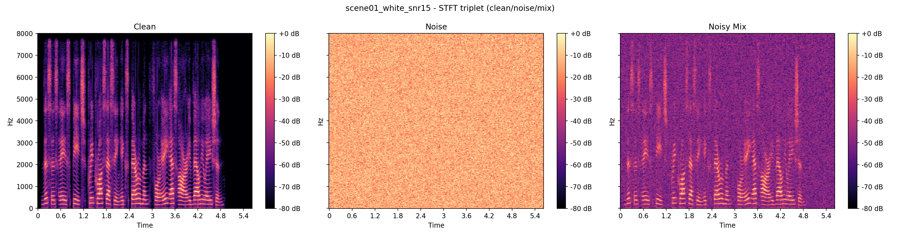  
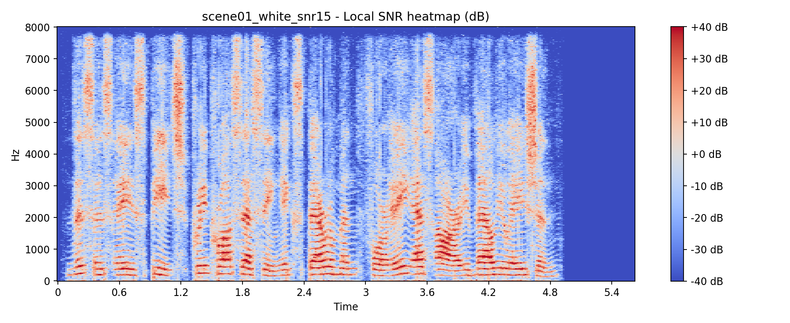  
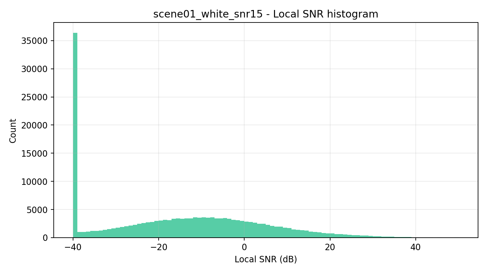

---

## 4. 统计特性分析

### 4.1 幅度分布拟合（KS p-value）

| 信号 | Rayleigh | Laplace | Gaussian |
|---|---:|---:|---:|
| clean 幅度 | 0.0000 | 0.0000 | 0.0000 |
| noise 幅度 | 0.0000 | 0.0000 | 0.0000 |

### 4.2 功率分布拟合（KS p-value）

| 信号 | Exponential | Log-normal |
|---|---:|---:|
| clean 功率 | 0.0000 | 0.0000 |
| noise 功率 | 0.0000 | 0.0000 |

### 4.3 相关性衰减

| 指标 | 值 |
|---|---:|
| 时间相关衰减临界滞后 | 4 帧 |
| 频率相关衰减临界滞后 | 3 频点 |

### 4.4 图表（统计）

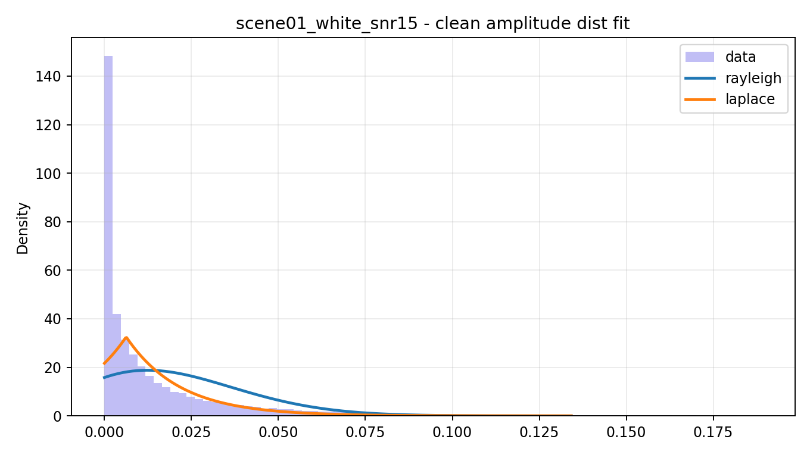  
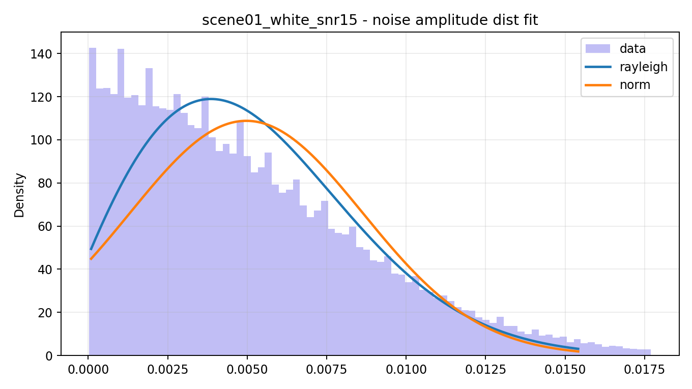  
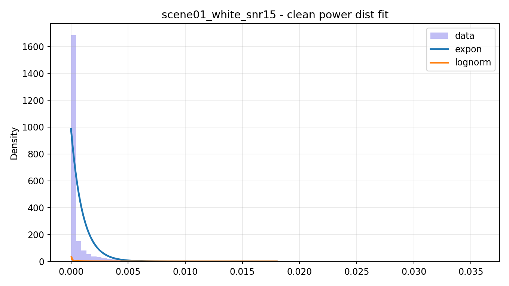  
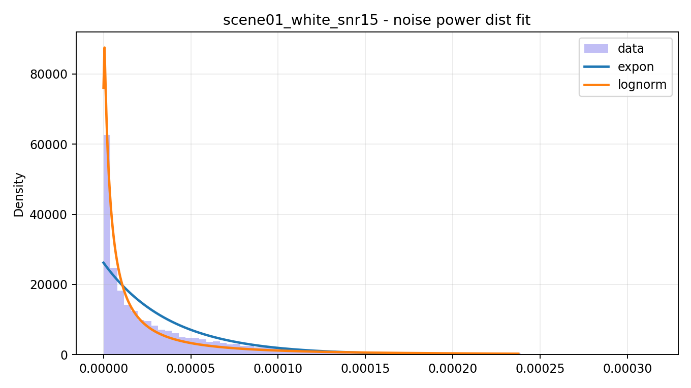  
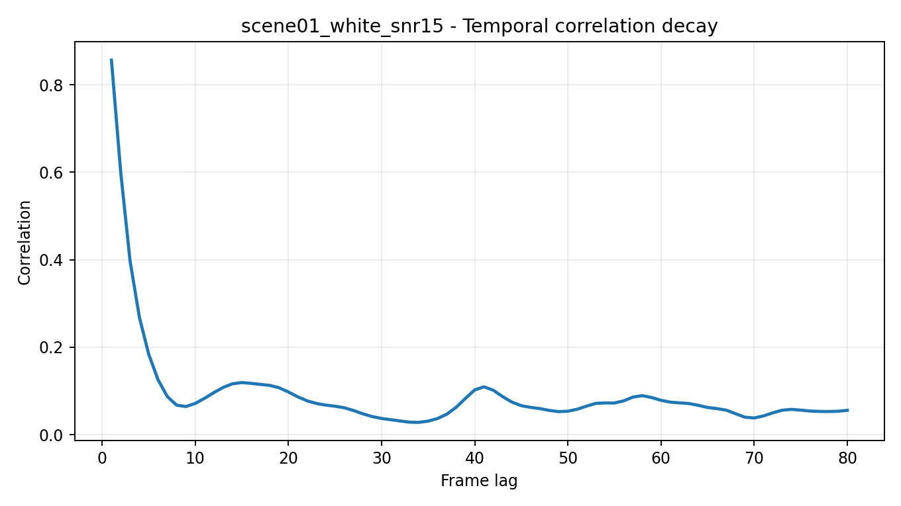  
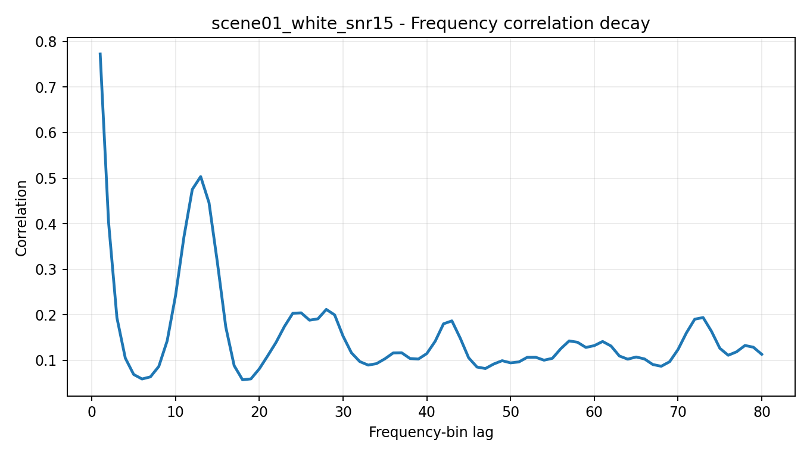

---

## 5. 噪声专项分析

### 5.1 噪声类型判定

基于谱平坦度（mean=0.561）+ ZCR（mean=0.500）+ PSD 形态：  
判定为接近白噪声的宽带噪声（近似平坦，但在混合场景下表现出轻度非平稳性）。

### 5.2 多特征空间可分性

- 能量可分性：0.985  
- ZCR 可分性：2.097  
- 谱平坦度可分性：1.750  

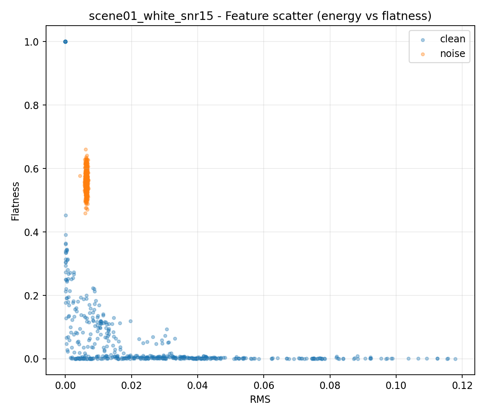

### 5.3 经典谱减法缺陷预评估（残留噪声）

| 指标 | 数值 |
|---|---:|
| 残留 RMS | 0.003462 |
| 残留峰态（kurtosis） | 4.381 |
| 残留谱平坦度均值 | 0.203 |

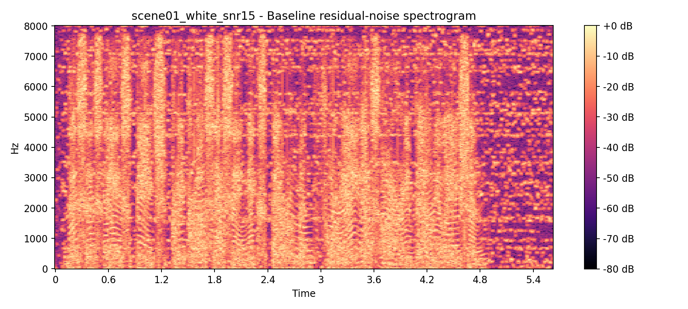  
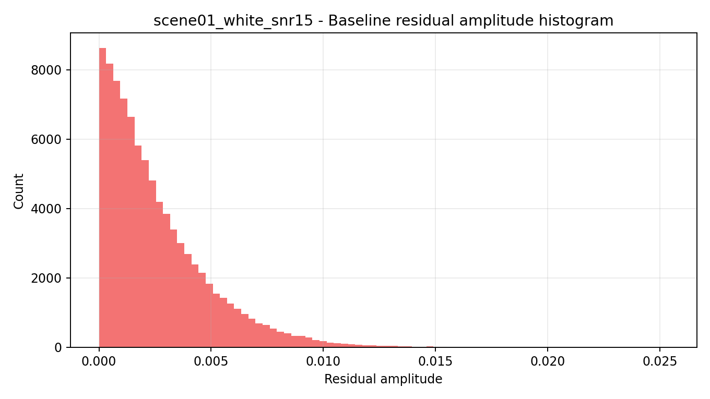

### 5.4 算法性能瓶颈预测

1. 高频段 SNR 低（1.46 dB）导致高频辅音恢复难。  
2. 局部低SNR占比高（`SNR<0 dB` 达 76.72%）导致固定过减失效。  
3. 残留统计重尾（kurtosis=4.381）提示音乐噪声风险，需专门抑制。  

---

## 6. 算法设计指导（ANASS）

### 6.1 VAD门控噪声估计（NoiseEstimator）

- **门控特征组合：RMS + ZCR + 谱平坦度**
- **门控策略：软门控优于硬阈值**
- **噪声更新因子 `noise_update` 初值：`0.87 ~ 0.93`**

### 6.2 自适应过减系数（Adaptive Alpha/Beta）

- **`alpha_low`: 1.4 ~ 2.0**
- **`alpha_high`: 3.2 ~ 4.0**
- **`beta_low`: 0.008 ~ 0.0176**
- **`beta_high`: 0.045 ~ 0.0765**

分频策略：
- **低/中频（<3.4kHz）语音保护优先**（较低 alpha）
- **高频（>3.4kHz）抑噪优先**（较高 alpha + 较高 beta 下限）

### 6.3 音乐噪声抑制（ArtifactSuppressor）

- **`time_smoothing`: 0.15 ~ 0.35**
- **`freq_smoothing`: 0.05 ~ 0.16**
- **增益地板 + 邻域一致性约束**避免点状伪影

---

## 7. 最终结论

- scene01 属于“宽带白噪 + 高比例局部低SNR”场景。  
- ANASS 有效路线为：  
  **软门控噪声估计 + 时频自适应过减 + 小窗平滑抑制音乐噪声**。  
- 优先优化方向：  
  1) 高频子带增益曲线；2) 低SNR区域平滑一致性；3) 浊音周期结构保护。  
