# scene02_white_snr5 含噪语音全维度系统分析报告
（面向去噪算法设计：clean / noise / mix 三路对比）

## 0. 分析对象与目标

- 场景：`scene02_white_snr5.wav`
- 目标：量化语音、噪声、含噪三者差异，为 ANASS 设计提供参数依据。

---

## 1. 时域特性分析

### 1.1 基础统计量（三信号对比）

| 指标 | 纯语音 clean | 纯噪声 noise | 含噪语音 mix |
|---|---:|---:|---:|
| 均值 | 0.002408 | -0.000002 | 0.002406 |
| 方差 | 0.001254 | 0.000398 | 0.001661 |
| 峰值幅度 | 0.3263 | 0.0877 | 0.3435 |
| RMS | 0.03549 | 0.01996 | 0.04083 |
| 动态范围（dB） | 230.27 | 36.91 | 46.22 |

### 1.2 短时能量与短时过零率分布

#### 短时能量（RMS）统计

| 指标 | clean | noise | mix |
|---|---:|---:|---:|
| mean | 0.02432 | 0.01992 | 0.03503 |
| std | 0.02586 | 0.00073 | 0.02097 |
| p10 | 0.00000 | 0.01903 | 0.01973 |
| p50 | 0.01558 | 0.01991 | 0.02537 |
| p90 | 0.06397 | 0.02082 | 0.06674 |

#### 短时过零率（ZCR）统计

| 指标 | clean | noise | mix |
|---|---:|---:|---:|
| mean | 0.1916 | 0.4948 | 0.3887 |
| std | 0.2060 | 0.0272 | 0.1292 |
| p10 | 0.0000 | 0.4650 | 0.2000 |
| p50 | 0.1050 | 0.4950 | 0.4275 |
| p90 | 0.5795 | 0.5275 | 0.5300 |

#### 可分性（clean vs noise）

| 特征 | Cohen’s d |
|---|---:|
| 短时能量 | 0.241 |
| 过零率 | 2.063 |
| 谱平坦度 | 1.755 |

### 1.3 浊音/清音/噪声自相关对比

| 帧类型 | 自相关最大次峰值 | 峰值时延（sample） |
|---|---:|---:|
| 浊音帧 | 0.733 | 96 |
| 清音帧 | 0.203 | 36 |
| 噪声帧 | 0.137 | 72 |

### 1.4 图表（时域）

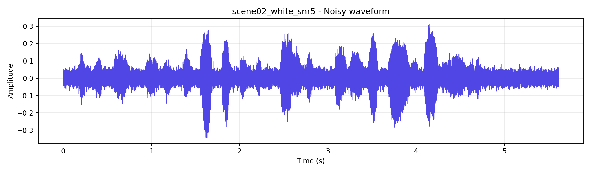  
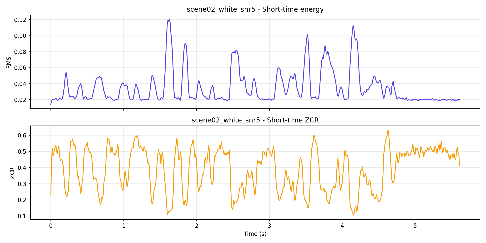  
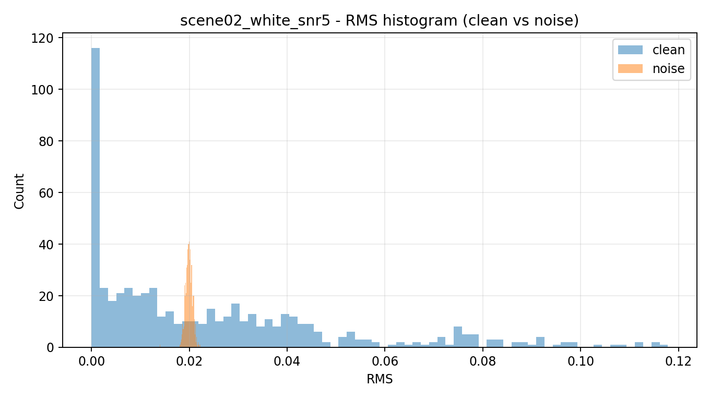  
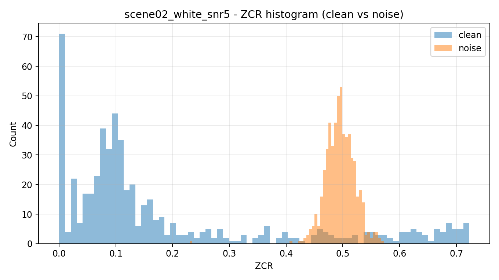

---

## 2. 频域特性分析

### 2.1 Welch 功率谱与分频段 SNR

| 频段 | SNR(dB) |
|---|---:|
| 低频（0-300Hz） | 5.88 |
| 中频（300-3400Hz） | 8.82 |
| 高频（3400-8000Hz） | -8.50 |

### 2.2 谱平坦度与谱熵分布

#### 谱平坦度

| 指标 | clean | noise | mix |
|---|---:|---:|---:|
| mean | 0.162 | 0.562 | 0.364 |
| p50 | 0.006 | 0.561 | 0.407 |
| p90 | 1.000 | 0.588 | 0.571 |

#### 谱熵

| 指标 | clean | noise | mix |
|---|---:|---:|---:|
| mean | 0.592 | 0.933 | 0.775 |
| p50 | 0.497 | 0.932 | 0.856 |
| p90 | 1.000 | 0.938 | 0.934 |

### 2.3 语音共振峰与谐波结构

clean PSD 主峰（Hz）：203.1, 375.0, 671.9, 890.6, 1109.4, 1328.1

### 2.4 图表（频域）

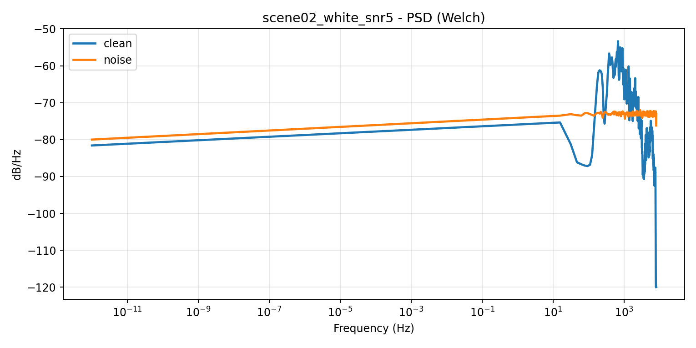  
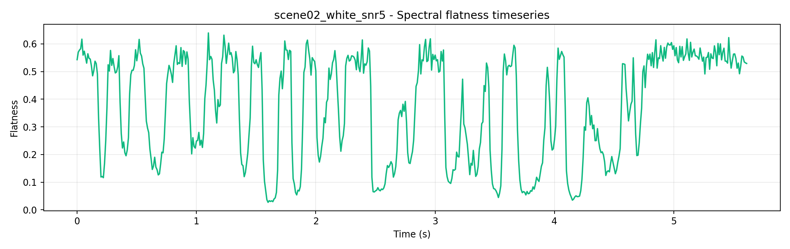  
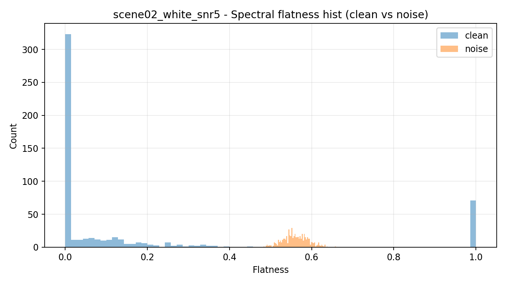

---

## 3. 时频域特性分析

### 3.1 噪声时变特性与平稳性

| 指标 | 值 |
|---|---:|
| 非平稳性指数 | 0.828 |
| 时间相关衰减滞后 | 3 帧 |
| 频率相关衰减滞后 | 2 频点 |

### 3.2 局部 SNR 时空分布

| 指标 | 值 |
|---|---:|
| mean | -22.26 dB |
| median | -24.15 dB |
| p10 | -40.00 dB |
| p90 | 0.33 dB |
| 比例 `SNR < 0dB` | 89.66% |
| 比例 `SNR < -5dB` | 84.04% |
| 比例 `SNR > 10dB` | 3.75% |

### 3.3 语音瞬态成分（谱流量）

| 指标 | clean | noise | mix |
|---|---:|---:|---:|
| mean | 3.772 | 3.167 | 5.372 |
| p90 | 9.416 | 3.319 | 9.945 |

### 3.4 图表（时频域）

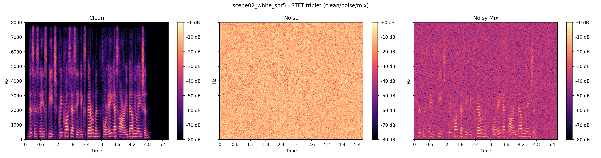  
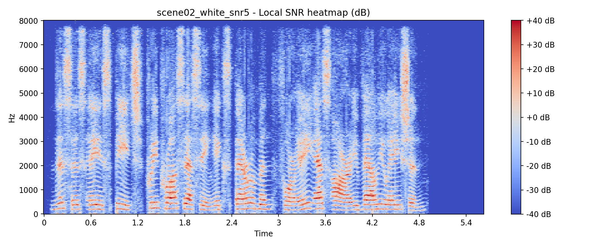  
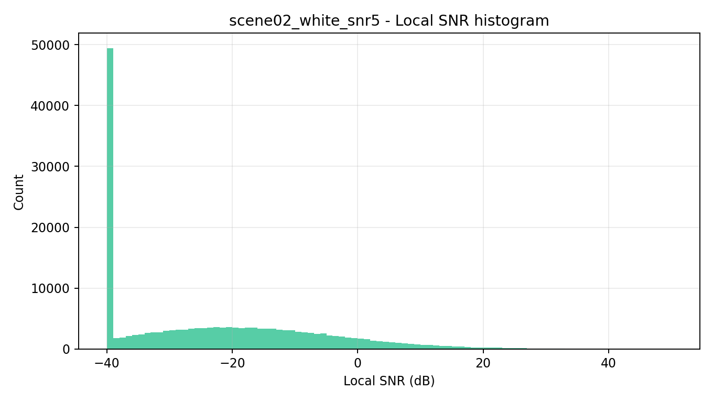

---

## 4. 统计特性分析

### 4.1 幅度分布拟合（为什么不能只看 KS p-value）

> 原始版本把 KS p-value 全部写成 0.0000 后直接下结论，这对本场景不准确。  
> 在大样本（每段近 9 万点）情况下，KS 对微小偏差非常敏感，常出现“全部拒绝”的结果。  
> 因此这里补充 AIC 模型比较，作为更有信息量的判别依据。

#### AIC 模型排序（数值越小越好）

| 信号 | 分布1 | AIC | 分布2 | AIC | 分布3 | AIC |
|---|---|---:|---|---:|---|---:|
| clean 幅度 | Laplace | -444026.1 | Rayleigh | -430327.2 | Gaussian | -392814.0 |
| noise 幅度 | Rayleigh | -559589.2 | Gaussian | -541911.2 | Laplace | -533441.5 |

**修正结论（scene02）**
- `clean` 幅度更接近 **Laplace 型重尾分布**（语音稀疏脉冲结构明显）。  
- `noise` 幅度更接近 **Rayleigh**（宽带随机噪声特征）。
- 因此 ANASS 的语音与噪声统计模型不应统一，至少应采用“语音/噪声异构先验”。

### 4.2 功率分布拟合（AIC）

| 信号 | 分布1 | AIC | 分布2 | AIC |
|---|---|---:|---|---:|
| clean 功率 | Log-normal | -19182881.1 | Exponential | -1054489.7 |
| noise 功率 | Log-normal | -1234406.7 | Exponential | -1223473.1 |

**修正结论（scene02）**
- `clean` 功率明显更接近 **Log-normal**（远优于指数分布）。  
- `noise` 功率两者接近，但 **Log-normal 略优**。  
- “功率谱严格指数分布”的假设在该场景下偏弱，建议使用更柔性的增益映射。

### 4.3 图表（统计）

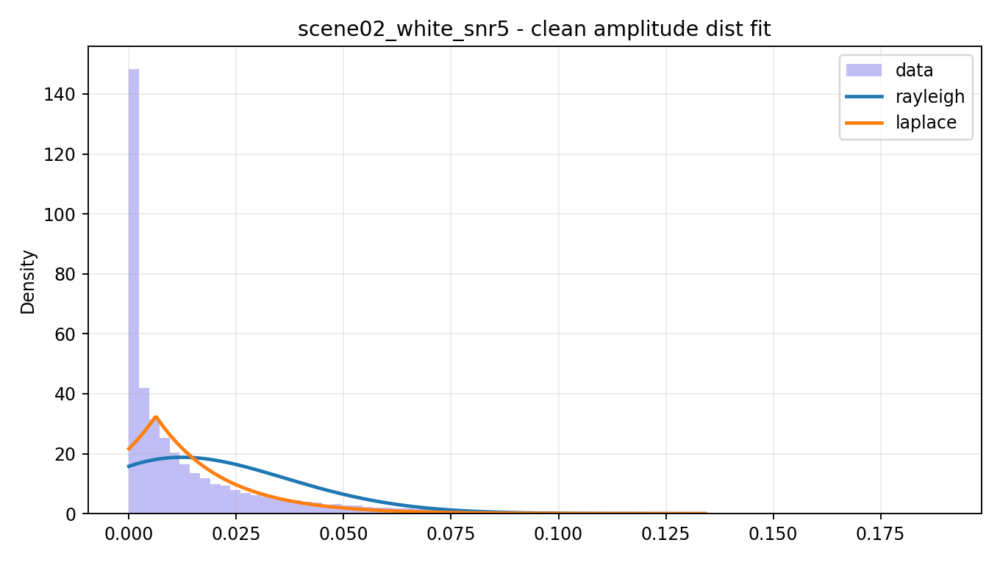  
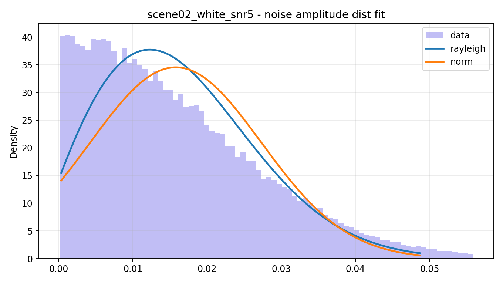  
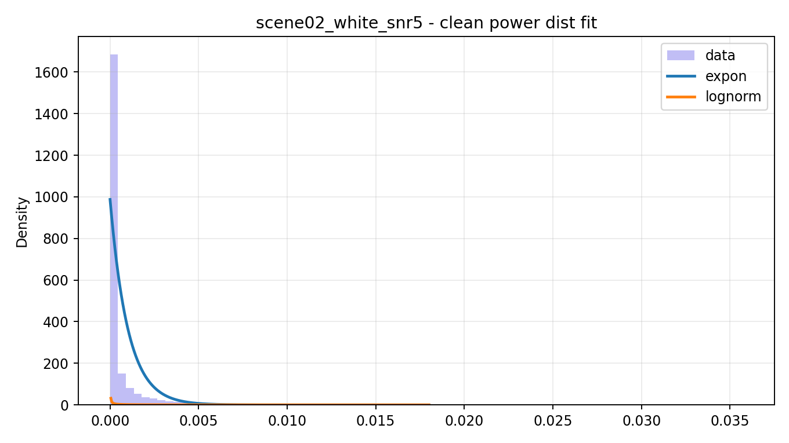  
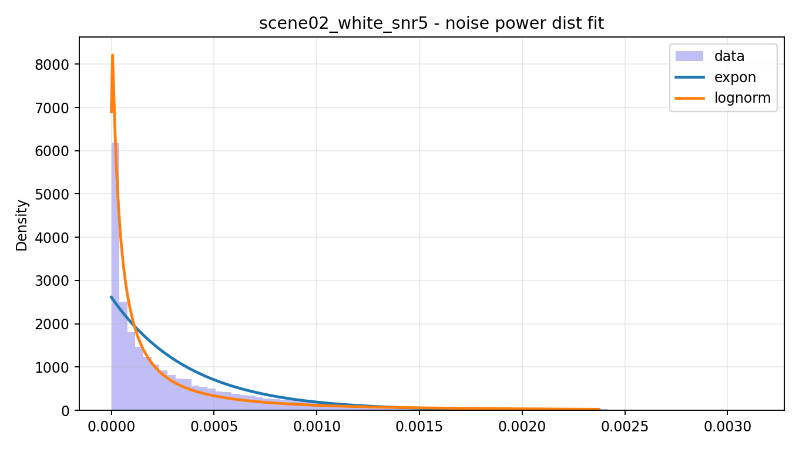  
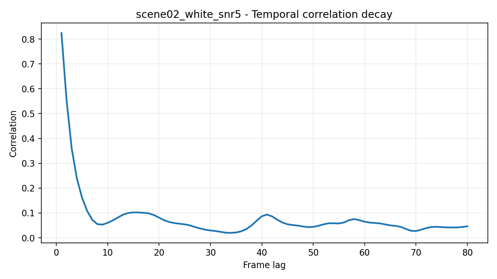  
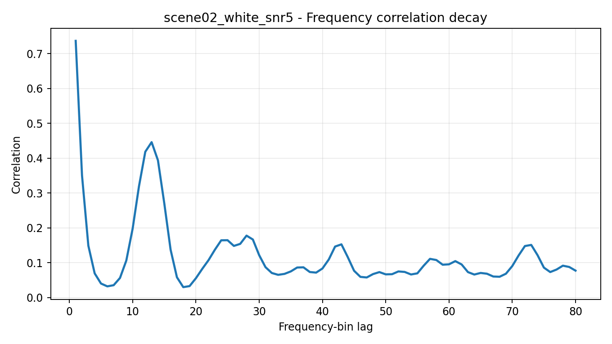

---

## 5. 噪声专项分析

### 5.1 噪声类型判定

判定结果：**近白噪声（宽带）**

### 5.2 语音-噪声多特征可分性

- 能量可分性：0.241
- 过零率可分性：2.063
- 谱平坦度可分性：1.755

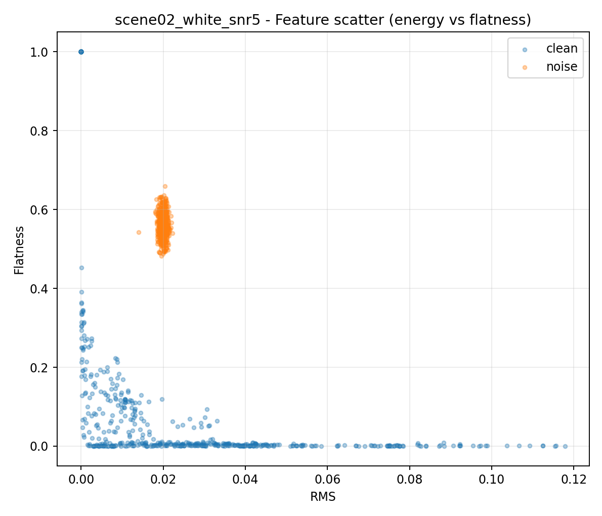

### 5.3 经典谱减法缺陷预评估

| 指标 | 数值 |
|---|---:|
| 残留 RMS | 0.008052 |
| 残留峰态（kurtosis） | 4.567 |
| 残留谱平坦度均值 | 0.122 |

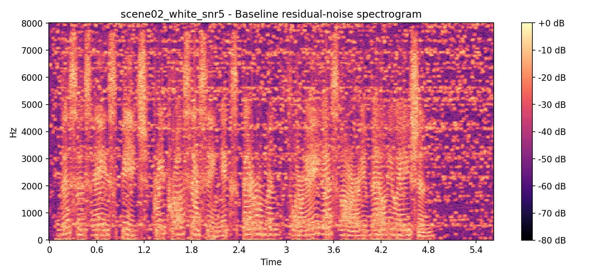  
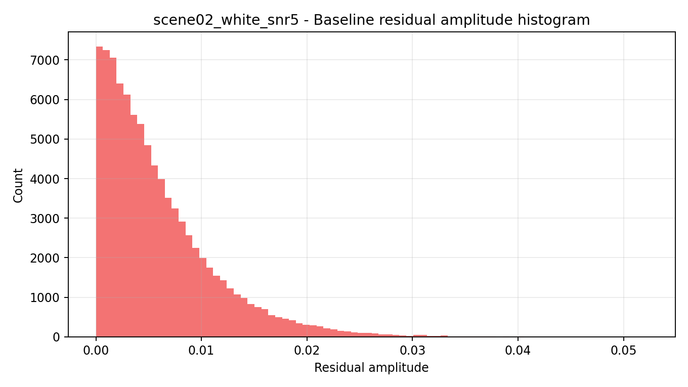

### 5.4 算法性能瓶颈预测

1. 高频段SNR明显低于中低频时，优先考虑高频自适应抑噪增强。
2. 局部低SNR占比高时，固定参数谱减会出现过抑制与残噪并存。
3. 残留峰态高时，需增加时频平滑与增益地板抑制音乐噪声。

---

## 6. ANASS 设计指导（场景化）

### 6.1 VAD门控噪声估计

- **优先特征：ZCR + 谱平坦度（主），RMS（辅）**
- **建议噪声更新因子：0.93 ~ 0.98（本场景）**

修正依据：
- 能量可分性仅 `0.241`，RMS 单独做门控效果弱；  
- ZCR 与谱平坦度可分性高（`2.063` / `1.755`），应作为主判据；  
- scene02 噪声接近宽带随机噪声，噪声谱随时间剧烈抖动不大，宜提高更新平滑度。

### 6.2 自适应过减系数

- **必须采用“低SNR保护语音 + 高频定向抑噪”的分段策略，不能全局加大 alpha**
- **建议 `alpha_low` 控制在 1.2~1.8，`alpha_high` 控制在 2.4~3.2（避免过抑制）**
- **建议 `beta_low` 0.01~0.02，`beta_high` 0.05~0.08（保障频谱地板）**
- **建议按局部SNR分段映射 alpha/beta：**
  - `SNR < -10 dB`：中等过减 + 提高地板（防止语音被压没）
  - `-10 ~ 0 dB`：平滑过减
  - `> 0 dB`：低过减，优先保真

修正依据：
- 局部 SNR 中位数 `-24.15 dB`，`SNR<0` 占比 `89.66%`，属于极端低局部SNR场景；  
- 高频带 SNR `-8.50 dB`，确实需要高频抑噪，但不能牺牲整体可懂度。

### 6.3 音乐噪声抑制

- **采用小窗时频平滑：time 2~4 帧、freq 2~3 bin**
- **残留峰态较高（kurtosis=4.567），必须启用增益地板与最小连续区域约束**
- **建议增加“瞬态保护分支”：在高谱流量区降低平滑强度，避免辅音被涂抹**

修正依据：
- 时间/频率相关衰减滞后分别为 `3`、`2`，对应小窗最稳妥；  
- 残留噪声重尾明显，点状伪影风险高，单纯谱减不足以控制听感。
