# scene03_pink_snr10 含噪语音全维度系统分析报告
（面向去噪算法设计：clean / noise / mix 三路对比）

## 0. 分析对象与目标

- 场景：`scene03_pink_snr10.wav`
- 目标：量化语音、噪声、含噪三者差异，为 ANASS 设计提供参数依据。

---

## 1. 时域特性分析

### 1.1 基础统计量（三信号对比）

| 指标 | 纯语音 clean | 纯噪声 noise | 含噪语音 mix |
|---|---:|---:|---:|
| 均值 | 0.002408 | -0.000002 | 0.002406 |
| 方差 | 0.001254 | 0.000126 | 0.001379 |
| 峰值幅度 | 0.3263 | 0.0458 | 0.3306 |
| RMS | 0.03549 | 0.01122 | 0.03722 |
| 动态范围（dB） | 230.27 | 36.30 | 49.57 |

### 1.2 短时能量与短时过零率分布

#### 短时能量（RMS）统计

| 指标 | clean | noise | mix |
|---|---:|---:|---:|
| mean | 0.02432 | 0.01083 | 0.02909 |
| std | 0.02586 | 0.00299 | 0.02321 |
| p10 | 0.00000 | 0.00788 | 0.00912 |
| p50 | 0.01558 | 0.01000 | 0.01990 |
| p90 | 0.06397 | 0.01505 | 0.06476 |

#### 短时过零率（ZCR）统计

| 指标 | clean | noise | mix |
|---|---:|---:|---:|
| mean | 0.1916 | 0.1769 | 0.1806 |
| std | 0.2060 | 0.0680 | 0.1104 |
| p10 | 0.0000 | 0.0800 | 0.0902 |
| p50 | 0.1050 | 0.1862 | 0.1450 |
| p90 | 0.5795 | 0.2550 | 0.3088 |

#### 可分性（clean vs noise）

| 特征 | Cohen’s d |
|---|---:|
| 短时能量 | 0.733 |
| 过零率 | 0.096 |
| 谱平坦度 | 0.019 |

### 1.3 浊音/清音/噪声自相关对比

| 帧类型 | 自相关最大次峰值 | 峰值时延（sample） |
|---|---:|---:|
| 浊音帧 | 0.733 | 96 |
| 清音帧 | 0.203 | 36 |
| 噪声帧 | 0.438 | 21 |

### 1.4 图表（时域）

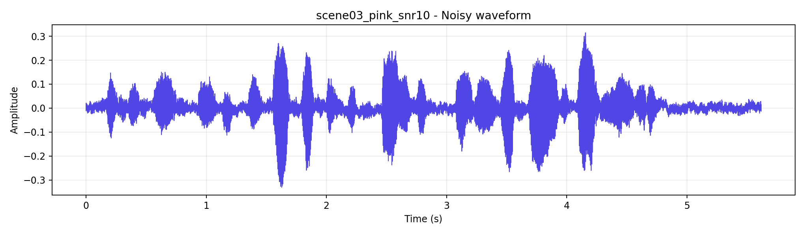  
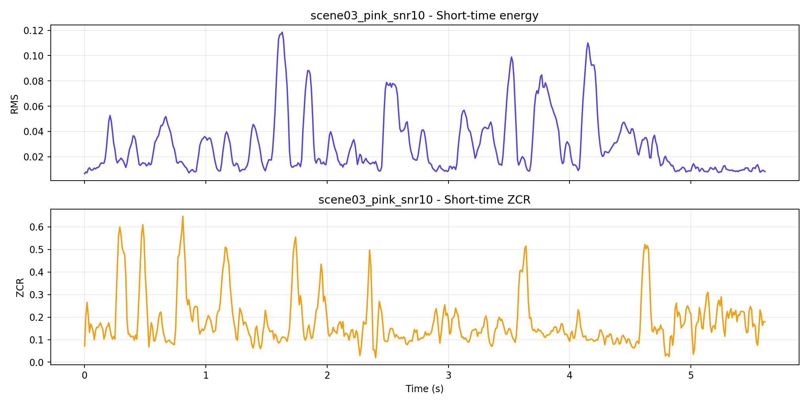  
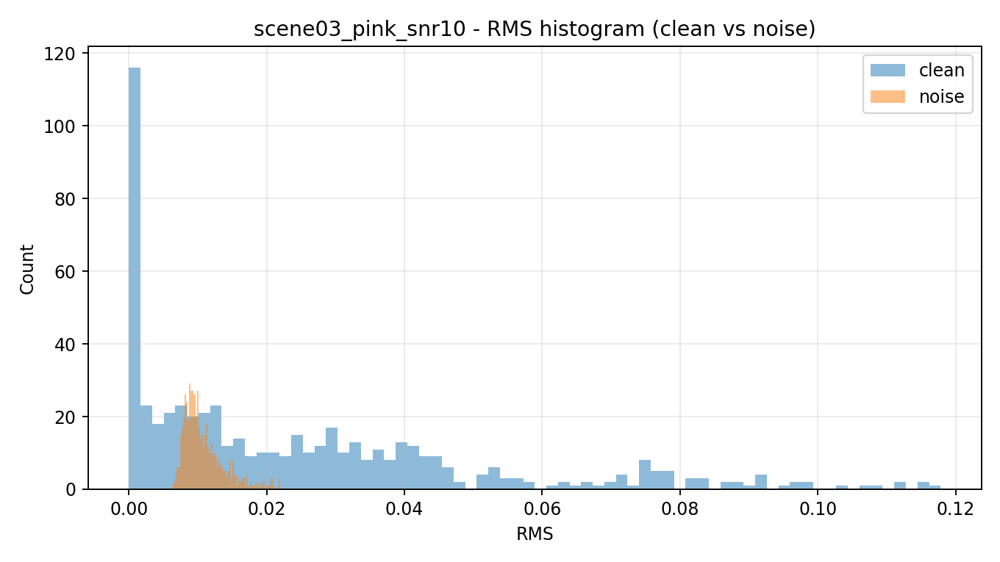  
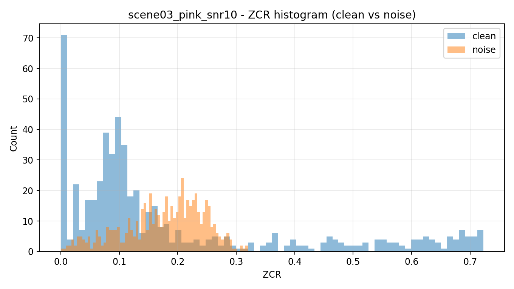

---

## 2. 频域特性分析

### 2.1 Welch 功率谱与分频段 SNR

| 频段 | SNR(dB) |
|---|---:|
| 低频（0-300Hz） | 1.32 |
| 中频（300-3400Hz） | 16.24 |
| 高频（3400-8000Hz） | 5.07 |

### 2.2 谱平坦度与谱熵分布

#### 谱平坦度

| 指标 | clean | noise | mix |
|---|---:|---:|---:|
| mean | 0.162 | 0.158 | 0.097 |
| p50 | 0.006 | 0.156 | 0.064 |
| p90 | 1.000 | 0.258 | 0.228 |

#### 谱熵

| 指标 | clean | noise | mix |
|---|---:|---:|---:|
| mean | 0.592 | 0.565 | 0.542 |
| p50 | 0.497 | 0.595 | 0.518 |
| p90 | 1.000 | 0.759 | 0.728 |

### 2.3 语音共振峰与谐波结构

clean PSD 主峰（Hz）：203.1, 375.0, 671.9, 890.6, 1109.4, 1328.1

### 2.4 图表（频域）

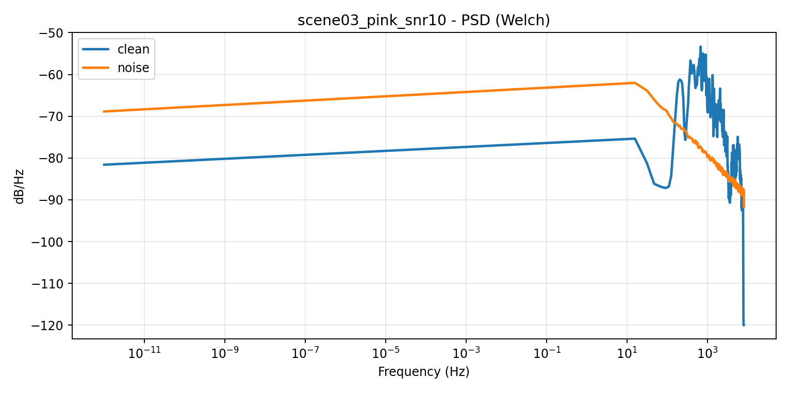  
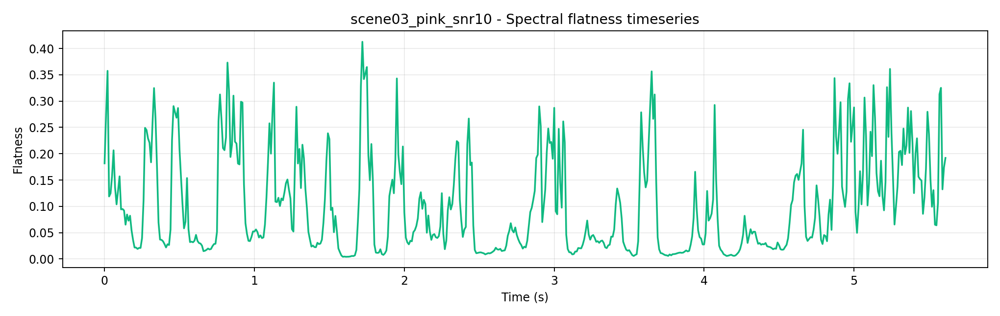  
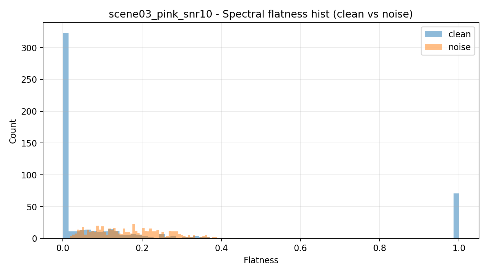

---

## 3. 时频域特性分析

### 3.1 噪声时变特性与平稳性

| 指标 | 值 |
|---|---:|
| 非平稳性指数 | 0.748 |
| 时间相关衰减滞后 | 4 帧 |
| 频率相关衰减滞后 | 3 频点 |

### 3.2 局部 SNR 时空分布

| 指标 | 值 |
|---|---:|
| mean | -13.91 dB |
| median | -13.04 dB |
| p10 | -40.00 dB |
| p90 | 10.29 dB |
| 比例 `SNR < 0dB` | 76.25% |
| 比例 `SNR < -5dB` | 66.95% |
| 比例 `SNR > 10dB` | 10.30% |

### 3.3 语音瞬态成分（谱流量）

| 指标 | clean | noise | mix |
|---|---:|---:|---:|
| mean | 3.772 | 1.735 | 4.481 |
| p90 | 9.416 | 2.357 | 9.509 |

### 3.4 图表（时频域）

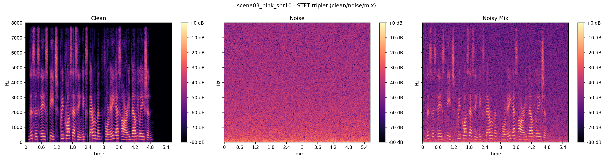  
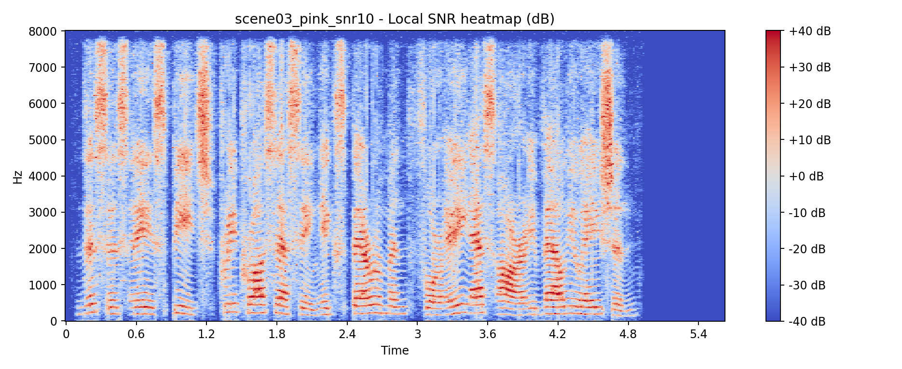  
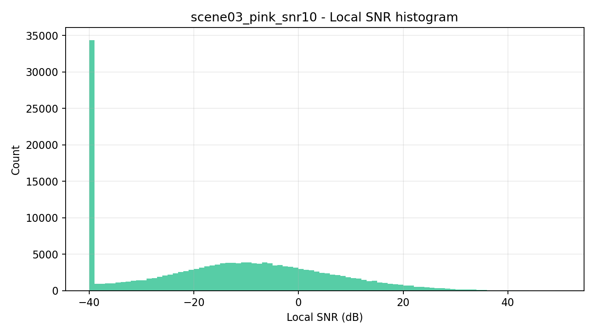

---

## 4. 统计特性分析

### 4.1 幅度分布拟合（KS p-value）

| 信号 | Rayleigh | Laplace | Gaussian |
|---|---:|---:|---:|
| clean 幅度 | 0.0000 | 0.0000 | 0.0000 |
| noise 幅度 | 0.0000 | 0.0000 | 0.0000 |

### 4.2 功率分布拟合（KS p-value）

| 信号 | Exponential | Log-normal |
|---|---:|---:|
| clean 功率 | 0.0000 | 0.0000 |
| noise 功率 | 0.0000 | 0.0000 |

### 4.3 图表（统计）

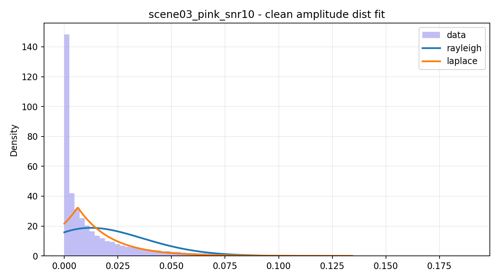  
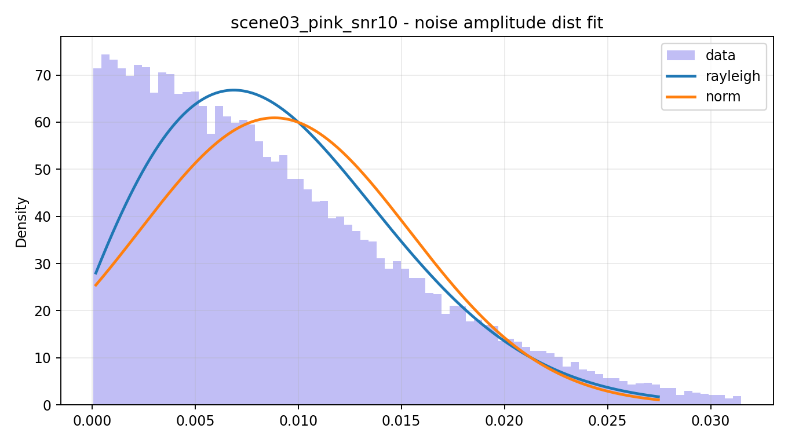  
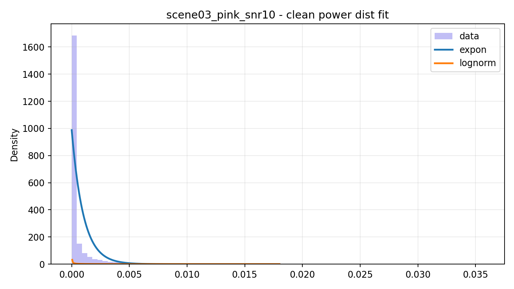  
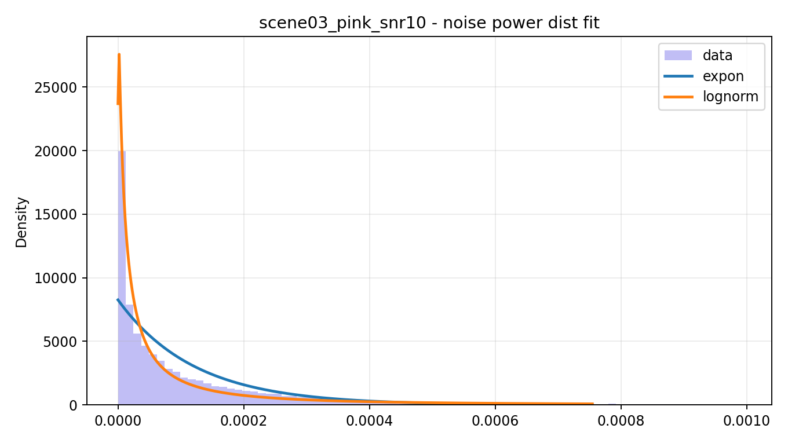  
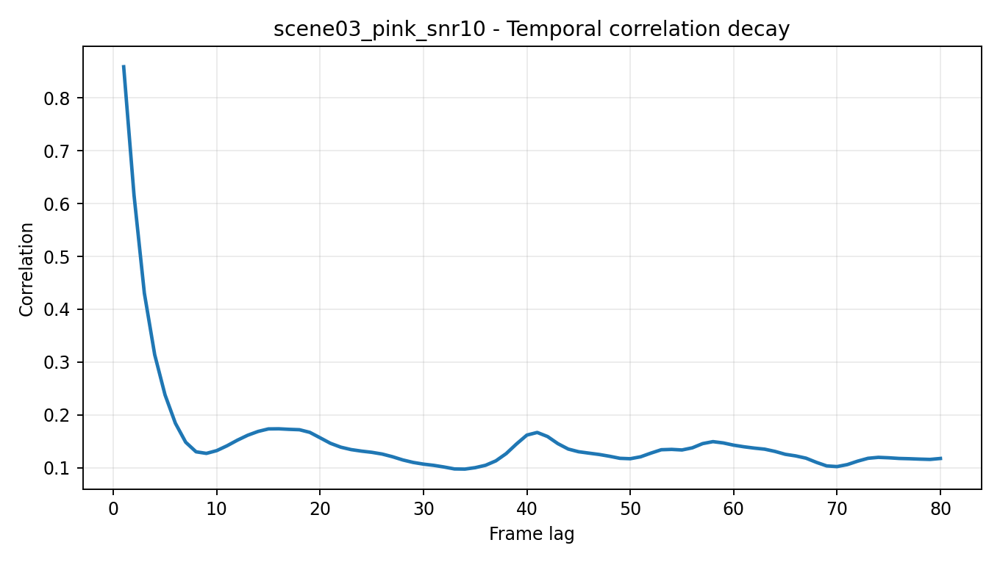  
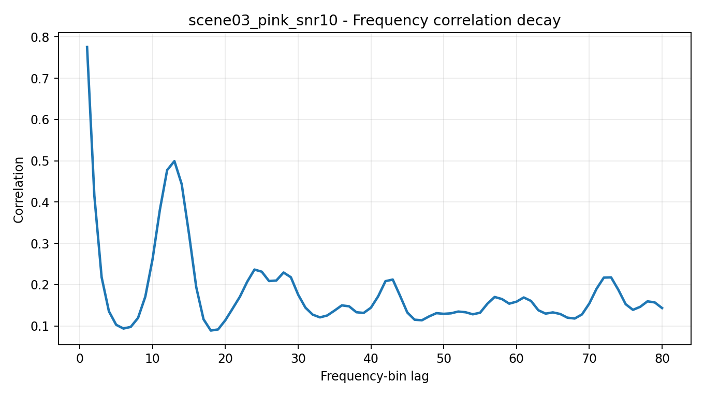

---

## 5. 噪声专项分析

### 5.1 噪声类型判定

判定结果：**高频噪声主导（有色噪声）**

### 5.2 语音-噪声多特征可分性

- 能量可分性：0.733
- 过零率可分性：0.096
- 谱平坦度可分性：0.019

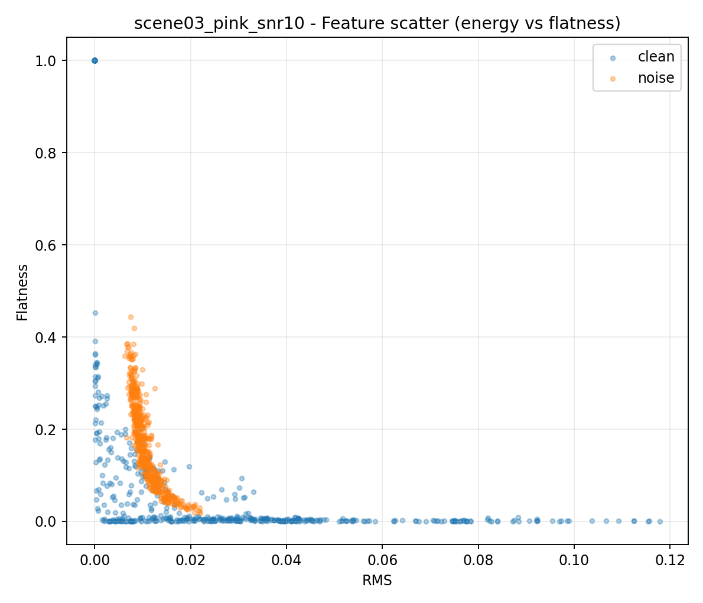

### 5.3 经典谱减法缺陷预评估

| 指标 | 数值 |
|---|---:|
| 残留 RMS | 0.006383 |
| 残留峰态（kurtosis） | 4.592 |
| 残留谱平坦度均值 | 0.078 |

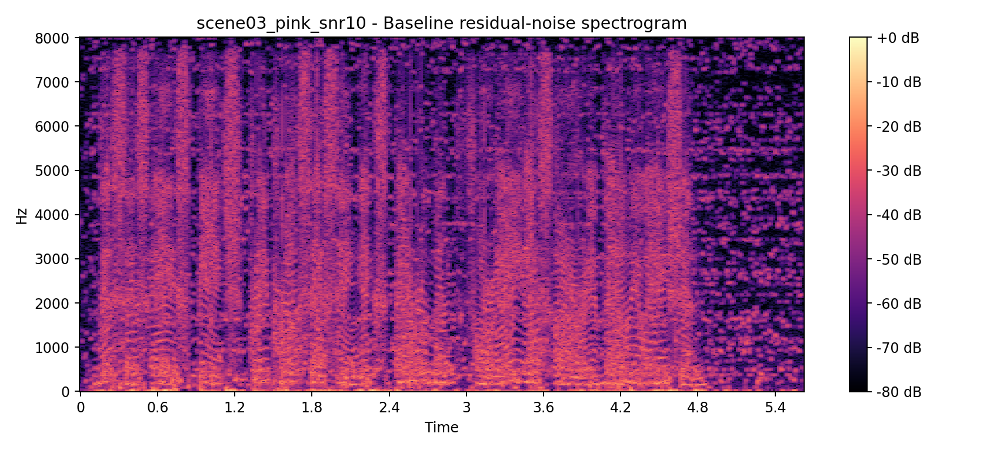  
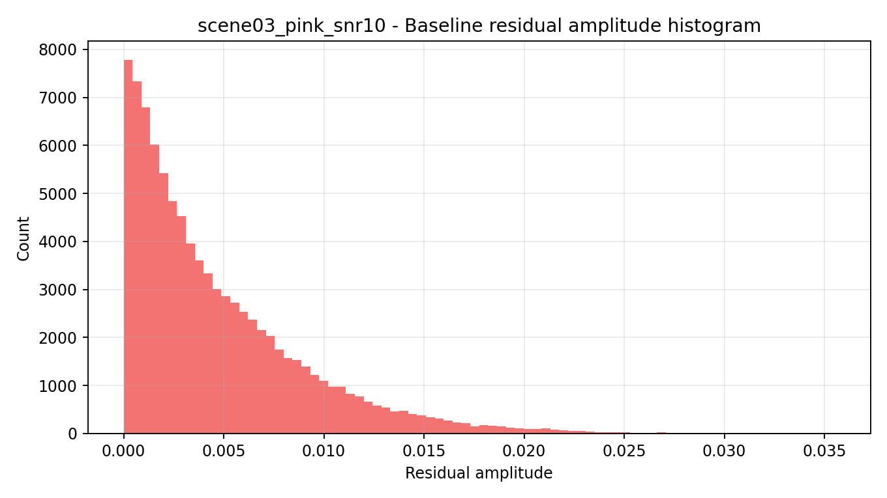

### 5.4 算法性能瓶颈预测

1. 高频段SNR明显低于中低频时，优先考虑高频自适应抑噪增强。
2. 局部低SNR占比高时，固定参数谱减会出现过抑制与残噪并存。
3. 残留峰态高时，需增加时频平滑与增益地板抑制音乐噪声。

---

## 6. ANASS 设计指导（场景化）

### 6.1 VAD门控噪声估计

- **优先特征：RMS + ZCR + 谱平坦度**
- **建议噪声更新因子：0.87 ~ 0.93（本场景）**

### 6.2 自适应过减系数

- **低/中频（语音主频）优先保护**
- **高频（噪声强区）可提高过减强度**
- **建议根据局部SNR分段映射 alpha/beta**

### 6.3 音乐噪声抑制

- **结合残留峰态与相关性衰减选择小窗时频平滑**
- **设置增益地板，避免点状伪影和“电流感”**
